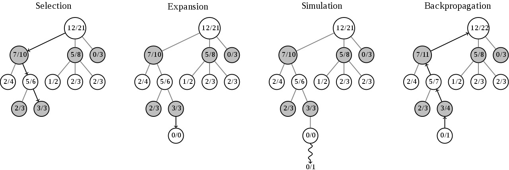
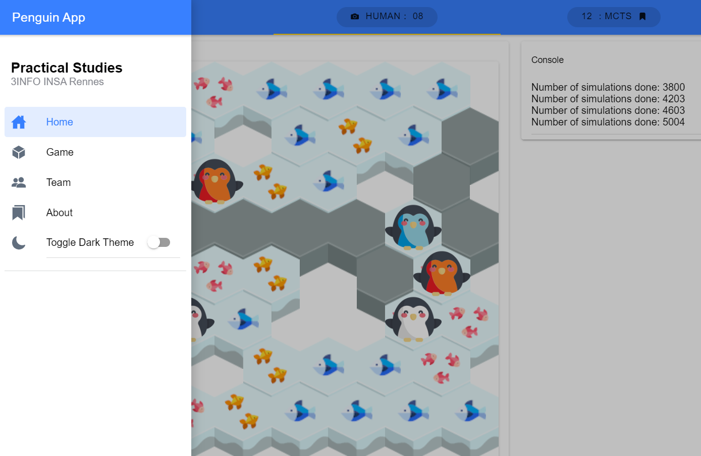
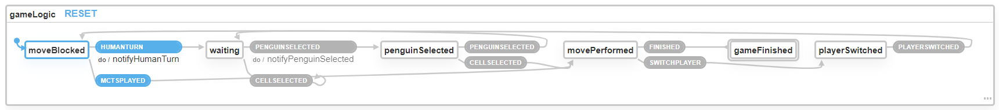

---
title: Jeu des pingouins à base de MCTS (_Monte Carlo Tree Search_) sur le navigateur en utilisant le format `WebAssembly`
author:

- Clément \textsc{Chavanon}
- Romain \textsc{Hu}
- Romain \textsc{Hubert}
- Maxime \textsc{Grimaud}
- Volodia \textsc{Parol-Guarino}
-

coauthor: "Encadrant : Pascal \\textsc{Garcia}"
date: 2019-2020
biblio-style: plain-fr
bibliography: references
...

# Introduction {.unnumbered}

"Pingouins" est un jeu de stratégie et de plateau sur lequel s'affrontent 2 à 4 joueurs. Le plateau contient 60 cases hexagonales qui comportent 1 à 3 poissons.

En début de partie, chaque joueur place un certain nombre de pingouins (de 2 à 4 suivant le nombre de joueurs) sur le plateau. A chaque tour, le joueur doit, si possible, bouger l'un de ses pingouins. Les déplacements autorisés se font en ligne droite suivant les 6 faces de la case hexagonale sur laquelle se trouve le pingouin. Il ne peut passer par-dessus des trous ou au-dessus d'autres pingouins, peu importe qu'ils appartiennent ou non au même joueur. Une fois le mouvement achevé, la case de départ est retirée du plateau. Le joueur peut alors incrémenter son score du nombre de poissons qu'il y avait sur cette case. 

Le jeu se termine lorsque plus aucun pingouin ne peut se déplacer. Le joueur avec le plus de points (poissons) remporte la partie.

# Sujet

Le sujet portait sur l'implémentation de ce jeu dans un environnement Web, en utilisant le nouveau standard `WebAssembly`. Les sources du projet sont compilées avec `Emscripten` qui permet de coder en `c++` pour la partie technique. L'interface devait se faire avec les bibliothèques _Simple DirectMedia Layer_.

## Récapitulatif

Afin de tester la faisabilité et les différentes technologies, nous avons décidé de procéder à la création de l'algorithme de façon abstraite et de tester avec un jeu simple et facilement implémentable : le morpion (servant alors de _Preuve de Concept_ - PdC). Pour la partie graphique, nous avions simplement codé en JavaScript pur. Pour la suite du projet, pour faciliter le développement de la partie front-end, nous avons décidé de choisir : `Angular`. Sur la PdC, nous avions testé une autre technologie pour gérer le graphisme du jeu : `PixiJS`. Cependant, plus tard, cela ne s'est pas avéré satisfaisant pour notre utilisation. En effet `PixiJS` nécessite une gestion asynchrone de son canvas, son intégration dans une application `Angular` doit donc se faire dans une zone indépendante, le lien avec le `WebAssembly` devenait alors trop complexe. 

## Précédemment

Ce projet n'est pas nouveau. Une précédente équipe y a déjà passé de nombreuses heures. Le cachier des charges était cependant différent car le jeu devait s'apparenté à une application bureau (écrite en Java), et n'était pas destiné a être porté sur le web. Afin de simplifier notre travail, il a été décidé de tout refaire, y compris le MCTS dont le code déjà optimisé leur avait été donné. En effet, notre technologie étant récente, la parallélisation de l'algorithme, par exemple, pouvait s'avérer plus compliquée à porter en `WebAssembly` qu'à réécrire.

## Objectif

Nous nous sommes principalement concentrés sur le fonctionnement correct de tout le projet et pas seulement de l'algorithme et du jeu. C'est pour cela que nous avons choisi de présenter un résultat plus correct qu'optimal (par exemple nous n'avons pas utilisé de représentation en _bitboards_, comme l'ont fait nos prédécesseurs, de même qu'ils n'ont pas eu l'algorithme lié au MCTS à gérer).

## Répartition

Pour mener à bien notre projet, les différentes tâches ont été réparties au sein des membres du groupe. Deux équipes ont été créées :

- Volodia et Romain Hubert pour la création du moteur du jeu en `c++` et optimisation du code (multithreading)
- Maxime, Romain Hu et Clément pour la création de l'interface Web et préparation du lien entre le moteur du jeu et la partie graphique

Finalement,  la tâche qui consistait à permettre de transporter le jeu codé en `c++` vers le navigateur a été faite par les membres des deux équipes (cf Bindings MCTS).


# Réalisation [^realisation]

[^realisation]: Toutes nos sources sont disponibles [@repo_git]. Nous avons également une démonstration en ligne [@repo_demo].

## Environnement de développement

Devant la variété d'OS utilisés au cours de cette année par les membres de notre équipe et le fait que nous allions développer un stack technique peu commun en `c++`, nous avons décidé de "simplifier" notre développement en utilisant les dernières fonctionnalités de VSCode et en utilisant le développement dans un *container* Docker. Cela permet au projet d'être extrêmement portable et d'être fonctionnel chez n'importe quel développeur !

Et en bonus nous avons réalisé ce rapport en `Markdown` afin qu'il soit facilement visible sur notre _repository_.

## Représentation du jeu

Notre encadrant nous a indiqué au tout début du projet un guide de méthodologies complet sur les plateaux hexagonaux et leurs représentations en informatique [@patel_blobs_2019]. En se basant sur ce guide et sur la forme rectangulaire de notre plateau, nous avons choisi une représentation en mémoire avec un conteneur associatif sous forme de table de hachage : `std::unordered_map`{.cpp}. Cela permet d'obtenir une complexité moyenne en temps de $O(1)$ et pas de $O(log(n))$ avec les représentations classiques, soit avec un conteneur associatif basé sur des arbres équilibrés : `std::map`{.cpp}. La représentation de la grille hexagonale sous forme rectangulaire crée des parties non utilisées dans le tableau  [@patel_blobs_2019, voir la section _map storage_].

## Points sensibles

Utiliser un algorithme tel que le MCTS implique que la vitesse et l’efficacité de ce dernier vont grandement être impactés par la représentation. Pour le MCTS, deux méthodes de la représentation du jeu ont un impact très important pour le niveau de l'intelligence artificielle que l'on obtient :

- la méthode servant à donner tous les cas disponibles pour un joueur, qui doit en effet analyser quelles routes sont possibles et jusqu'à quel endroit[^movesavailable];
- la méthode servant à donner l'état du jeu (aussi utilisée pour connaître le joueur suivant [^nextplayer]) qui doit vérifier s'il est encore possible pour un joueur de bouger [^movesavailable].

Une passe d'optimisation a déjà été réalisée sur la deuxième méthode qui reposait à la base sur la première (dans un effort d'obtenir le plus vite une démo fonctionnelle afin de déboguer des points plus vitaux). Cependant le temps manque pour faire plus, notamment nos prédécesseurs ont eu le temps[^theyhadtime] de vraiment attaquer le vif de l'optimisation, notamment avec les _bitboards_, qui leur ont permis une belle différence de performance (sans compter ici le fait que nous développons pour le web).

[^movesavailable]: Un pingouin peut être bloqué par un trou dans le plateau ou un autre pingouin.
[^nextplayer]: Il arrive qu'un joueur soit bloqué et qu'attendre son tour ne serve à rien, son adversaire peut lui continuer à récolter tous les points.
[^theyhadtime]: L'équipe précédente n'a pas eu à faire le MCTS et avait directement une interface connectant la représentation avec cet algorithme, sur laquelle nous avons dû faire quelques ajustements après avoir développé la représentation du jeu des pingouins. Nous faisons allusion ici à une différence entre le pion et le joueur : un joueur peut posséder plusieurs pions et ceci n'était pas une contrainte sur notre première phase de tests avec un morpion...

# MCTS
## Principe

Le *Monte Carlo Tree Search* (ou MCTS) est un algorithme de recherche heuristique. C'est un algorithme qui explore l'arbre des possibles. Au fur et à mesure que l'algorithme se déroule, cet arbre grandit. Il essaye d'explorer toutes les parties possibles du jeu, en privilégiant les issues favorables pour lui. L'arbre est composé de noeuds répartis sur plusieurs couches. Chaque noeud représente une configuration, et ses enfants sont les configurations suivantes. Les noeuds doivent aussi stocker le nombre de parties gagnantes et le nombre total de simulations (à partir de ce noeud).

Le principe de l'algorithme est simple ; il n'y a que quatre étapes. On commence par choisir le "meilleur" noeud terminal. On détermine le meilleur noeud terminal grâce à la fonction UCT qui permet d'évaluer le meilleur compromis entre le nombre de visites et le résultat du noeud. Puis on crée ses enfants. Ensuite, on choisit un de ses enfants et on simule une partie aléatoire. Enfin, on transmet ce résultat sur tous les noeuds jusqu'à la racine.



On répète ces 4 étapes jusqu'à ce qu'on arrête l'algorithme. Ensuite, il nous retourne le meilleur coup à jouer, basé sur le nombre de visites des enfants de la racine.

## Parallélisation

Afin d'augmenter les performances du MCTS, nous nous sommes penchés sur le multithreading. En effet, cela nous débloque la possibilité de simuler plusieurs parties en même temps, impliquant une augmentation du nombre de parties simulées. Il y a différentes manières de multithreader le MCTS; la _tree parallelization_, la _root parallelization_ et la _leaf parallelization_. D'après cette étude [@mass_par_mcts; @par_mcts], la _root parallelization_ semble la meilleure puisqu'elle permet d'explorer plus d'issues que les autres méthodes. Ainsi, cela augmente les chances de victoire du MCTS. De plus, cette méthode est facile à implémenter. En effet, il suffit d'assigner un arbre sur chaque thread. Les arbres sont donc développés indépendamment entre eux, donc il y a moins de chances que l'algorithme se bloque sur un minimum local. A la fin du temps alloué, nous mettons en commun les arbres, uniquement la première couche pour diminuer le temps de calcul. Ensuite, nous choisissons le meilleur coup à jouer.

Pour éviter de recréer l'arbre à chaque fois, nous avons mis en place un système de déplacement de la racine à un de ses enfants, gardant ainsi le sous-arbre de l'enfant.

# Interface graphique

Pour offrir une expérience de jeu optimale, et afin d'exporter le jeu sur un navigateur, nous avons dû mettre en place une interface graphique pour notre jeu. Avec les contraintes de temps et les contraintes techniques, nous avons été amenés à faire des choix aux niveaux des technologies utilisées et des méthodes d'implémentation afin de pouvoir produire rapidement une interface utilisable.

## `Angular` & `Ionic`

Afin de mettre en place, un code solide et rapidement exploitable, nous voulions impérativement utiliser `Typescript`, pour réaliser le moteur de jeu côté graphisme. En effet, son contrôle de typage est un véritable plus, par rapport à notre preuve de concept, où le moteur du morpion était en `Javascript`.
D'autre part, nous voulions construire une architecture de site Web plus globale qui viendrait englober la partie véritablement jouable. Afin de mettre en place cette architecture web sur pied au plus vite, nous nous avons décidé d'utiliser `Angular`.

Pour mettre en place la charte graphique de notre application, nous nous sommes tournés vers le framework `Ionic 4`, sorti récemment, qui offre aux développeurs des thèmes pré-conçus et des composants adaptatifs. Basé sur `Angular`, il s'intègre donc parfaitement dans notre projet.

## Organisation de l'application

Dans sa version finale notre application se compose des pages principales suivantes :

- une page d'accueil présentant le projet,
- une page avec le jeu en lui même,
- une page de présentation pour les membres de l'équipe,
- et une page pour les crédits.



Cette dernière permet, en plus de mettre à disposition le jeu des pingouins dans un navigateur web, de présenter le projet dans sa globalité, ainsi que les membres de l'équipe ayant participé à sa réalisation. L'ensemble du rendu graphique est défini par un ensemble de composants venant s'incruster dans des _pages Ionic_. La gestion et la levée d'évènement se fait conformément au standart _Angular_, et par un jeu de double bindings dans la hiérarchie des composants.

```{.cpp .numberLines startFrom="0"}
// Organisation de penguinApp
|-> pages
    |-> home
    |-> game
        |-> board
            |-> hex
            |-> penguin
            |-> models
        |-> control
        |-> console
        |-> info
     |-> team
     |-> about
```

Durant nos recherches dans les différentes possibilités que pouvaient nous offrir _Ionic_, nous avons mis en place la possibilité d'accéder à une deuxième charte graphique, définissant le `Dark Theme`.


## Automates finis

Que ce soit pour l'application entière, ou le jeu en particuler il a fallu mettre en place des automates finis (_Finite-State Machine_), afin de gérer le flot de contrôle, et contenir les actions possibles en fonction de l'état d'avencement. 


Le flot de contrôle est contenu par 2 machines à états : 

- une pour l'application globale (apparition des différents composants en fonction des interactions avec l'utilisateur)
- une deuxième pour gérer exclusivement le jeu

Pour mettre en place, ces automates finis, nous avons utilisé la librairie _Typescript_ `+xstate`, permettant de mettre en place rapidement des automates sous le jormat _JSON_. Cette dernière offre aussi un système de visualisation des machines.



L'Automate du jeu permet de dérouler la logique du jeu des pingouins, en limitant les interactions en fonction du joueur qui doit jouer. Le passage d'un état à un autre se fait par le déclenchement d'une action pré-enregistrée, souvent cette dernière est associée à un événement sur un composants _Ionic_. La progression dans le jeu se fait donc complètement indépendamment de l'application dans laquelle il est intégré. 

Cette manipulation d'état et d'événements permet d'offrir à l'utilisateur une intéraction agréable et visuelle avec le plateau de jeu.


# Liens entres toutes les parties

Il faut maintenant faire le lien entre l'interface graphique et le cœur du jeu. Il existe plusieurs niveaux de difficulté pour réaliser ces liens. Le plus simple nous l'avons utilisé lors de notre preuve de concept avec le morpion. Elle consiste à marquer les fonctions à exporter directement dans la commande de compilation et est adaptée pour une petite quantité de fonctions. Cependant, le passage à l'échelle ne se fait pas bien, c'est pour cela que nous avons utilisé la seconde méthode : _Embind_ [@embind]. Elle se traduit pour l'utilisateur en de simples lignes d'export de méthodes dans un préprocesseur. Les seules difficultés peuvent venir des _templates_ en `c++` qui peuvent faire grossir le code, mais un préprocesseur adapté suffit à limiter cela et de l'organisation générale du projet. C'est-à-dire que suivant où l'on situe ces lignes de lien, on peut avoir du mal à savoir quels classes sont concernées, c'est pour cela qu'en nous inspirant de `Angular` nous avons un ficher avec l'extension `*.bind.cpp` qui reprend toutes les fonctions exportées dans le dossier courant et permet ainsi d'avoir très peu de méthodes à écrire juste pour les liens. Le compilateur se charge alors de réaliser les liens automatiquement (et mêmes des pointeurs[^whatpointers] !). De plus la clarté gagnée par cette structure permet aussi de continuer à garder deux plateformes pour développer : le Web et Linux pour avoir accès à l'éventail d'outils de débogage existants. Un exemple d'un tel code est le suivant :

```{.cpp .numberLines startFrom="0"}
...
    // Only target Emscripten compilation (auto-generated flag)
#ifdef __EMSCRIPTEN__
...
using namespace emscripten;

// Binding code
EMSCRIPTEN_BINDINGS(mcts_bind)
{
    // Here exporting a c style structure with a field
    value_object<MCTSConstraints>("MCTSConstraints")
        .field("time", &MCTSConstraints::time);

    // It is a bit more complex to export a template,
    // especially if we want to take fully advantage 
    // of why they were made in the first place :
    // multiple types
#define __MCTS_BIND__(name_prefix, MCTSPlayer, AbstractGame)                               \
    class_<MCTSPlayer>(name_prefix "_MCTSPlayer")                                          \
        .constructor<AbstractGame *const &, const MCTSConstraints &>
    										(allow_raw_pointers()) \
        .function("bestMove", &MCTSPlayer::bestMove) 
    // We need to define the types (by clarity + 
    // 					limitation of the preprocessors)
    typedef MCTSPlayer< ... > penguin_mcts_player_t;
    typedef game::AbstractGame< ... > penguin_game_t;
    // We use it for the penguin game,
    // but it is as easy to export for the tic tac toe demo
    __MCTS_BIND__("penguin", penguin_mcts_player_t, penguin_game_t);
}

#endif
```

Notre second défi a été de lier la version parallélisée de notre programme avec `pthreads`[@pthreads_emscripten] et l'interface graphique. En effet, le Web a introduit sa propre version des _threads_ : les _WebWorkers_[^onwebworkers]. Cependant ils possèdent leur propre espace mémoire complètement séparé de l'application et ne permettent qu'une communication via des types primitifs : les `int` ou les `strings`. Il n'est donc pas aisé de communiquer des valeurs d'instances entres ces _WebWorkers_. Heureusement pour nous, le plus gros du travail est réalisé par _Emscripten_. Néanmoins, nous avons eu un problème inacceptable : le blocage du _thread_ principal de notre application lors du développement des arbres du MCTS, l'interface ne répondait alors plus. Pour pallier cela nous avons mis en place un mécanisme reposant sur _Asyncify_ [@asyncify] qui permet de faire des `pause` et `resume` dans le code `c++` exporté. Plus largement ce module permet de rendre le code asynchrone et donc de poursuivre le traitement des évènements tant appréciés de _JavaScript_ lors de l’exécution de notre algorithme qui n'est alors plus bloquant. Le résultat n'est pourtant pas ce que nous espérions, puisque la fonction exécutant le MCTS ne renvoie alors plus de valeur au final. Nous avons alors défini une fonction _JavaScript_ dans le code `c++`, de façon à ce que ce dernier puisse l'appeler. Cette fonction permet alors d'émettre un événement après que la fonction `c++` ait terminé [^whyafterterm]. Cette notification permet alors à l'interface de savoir quand récupérer la valeur de sortie et de pallier le problème initial.

[^onwebworkers]: Tout comme le `WebAssembly` les _WebWorkers_ ont un support encore limité aux versions récentes des navigateurs, pour ceux ne l'ayant pas désactivé pour des raisons de sécurité.
[^whatpointers]: Il existe les pointeurs intelligents en c++, seulement notre première utilisation de ces derniers a été d'utiliser la version `std::shared_pointers`{.cpp} à la première occasion. Devant notre ignorance nous nous sommes rabattus sur le classique des pointeurs `C`. Si nous avions continué nous aurions certainement abusé des pointeurs `shared` et fini par perdre massivement en performance et en mémoire, surtout que nous avions déjà en tête de multithreader notre application. Nous ne parlons que des `shared_pointers` puisque nous ne connaissions pas réellement les mécanismes de _ownership_ des `unique_pointers`.

# Conclusion {.unnumbered}

La mise en place de ce projet a permis de mettre en évidence les difficultés liées à la gestion de ce type de travail, notamment au niveau de l'organisation et les échéances temporelles. Notablement, au début nous n'avions pas les mêmes quantités de travail pour l'équipe graphique que pour la première version du MCTS.

Les technologies utilisées étaient le second point important de ce projet, certaines étaient déjà connues – voire maîtrisées – par des membres du groupe, néanmoins la plupart se sont avérées être une totale découverte. Il fallait donc être capable d'acquérir des connaissances technologiques (`WebAssembly`, MCTS_, _Multithreading_, `Angular` ...) mais également dans les outils nécessaires pour travailler dans une position peu commune (_VSCode_, `Docker`, `Doxygen`, `Compodoc`)  tout en développant  – pour permettre au projet d'avancer. Finalement, le résultat attendu par le cahier des charges a été plus qu'atteint : en effet, nous sommes en mesure de proposer un jeu des pingouins, implémentant une intelligence artificielle, et jouable à partir d'un navigateur Web. Nous avons démontré la viabilité et la maturité du _WebAssembly_[^wasmmature], tout en se heurtant à des obstacles – pas impossibles à passer – mais néanmoins gênants pour un environnement de production. Cette expérience nous a permis, en plus d'approfondir nos connaissances acquises au cours de l'année, de mieux connaître le fonctionnement de chacun et d'apprendre, en demandant conseil à notre encadrant lorsque cela devenait ardu, mais aussi à présenter notre travail [^englishisnotmyfav].

Pour finir : 

> _Laissons l'avenir dire la vérité, et évaluer chacun en fonction de son travail et de ses accomplissements. Le présent est à eux ; le futur, pour lequel j'ai réellement travaillé, est mien._
>
> -- <cite>Nikola Tesla</cite>

[^wasmmature]: un point étonnant est la possibilité d'allier deux géants dans leurs domaines : la versatilité du `JavaScript` et la puissance crue du `c++`.
[^englishisnotmyfav]: L’exercice s'est avéré étrange mais encourageant. 
